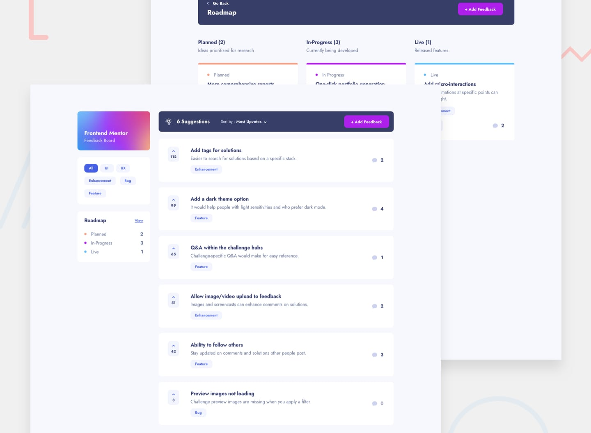

# Frontend Mentor - Product feedback app solution

This is a solution to the [Product feedback app challenge on Frontend Mentor](https://www.frontendmentor.io/challenges/product-feedback-app-wbvUYqjR6). Frontend Mentor challenges help you improve your coding skills by building realistic projects.

## Table of contents

- [Overview](#overview)
  - [The challenge](#the-challenge)
  - [Screenshot](#screenshot)
  - [Links](#links)
- [My process](#my-process)
  - [Built with](#built-with)
  - [What I learned](#what-i-learned)
- [Author](#author)
- [Acknowledgments](#acknowledgments)

**Note: Delete this note and update the table of contents based on what sections you keep.**

## Overview

### The challenge

Users should be able to:

- View the optimal layout for the app depending on their device's screen size
- See hover states for all interactive elements on the page
- Create, read, update, and delete product feedback requests
- Receive form validations when trying to create/edit feedback requests
- Sort suggestions by most/least upvotes and most/least comments
- Filter suggestions by category
- Add comments and replies to a product feedback request
- Upvote product feedback requests
- **Bonus**: Keep track of any changes, even after refreshing the browser (`localStorage` could be used for this if you're not building out a full-stack app)

### Screenshot

### Links

- Solution URL: [https://github.com/Briuwu/next-product-feedback-app](https://github.com/Briuwu/next-product-feedback-app)
- Live Site URL: [https://product-feed-uwu.vercel.app/](https://product-feed-uwu.vercel.app/)

## My process

### Built with

- Semantic HTML5 markup
- CSS custom properties
- Flexbox
- CSS Grid
- Mobile-first workflow
- [React](https://reactjs.org/) - JS library
- [Next.js](https://nextjs.org/) - React framework
- [Tailwind CSS](https://tailwindcss.com/) - For styles
- [Clerk](https://clerk.dev/) - For authentication
- [Neon](https://neon.tech/) - For database

### What I learned

#### What are you most proud of, and what would you do differently next time?

One of the highlights of working on this project was using Tailwind to make the website look good and work well. It was really enjoyable to see the design come to life on the screen. I also learned a lot about how to use Clerk and Neon to create a full-stack application. I would like to learn more about how to use these tools to create more complex applications in the future.

In the future, I plan to organize my work better so I can use the same parts across different pages, which will help me avoid doing the same thing many times. ヾ(≧▽≦\*)o

#### What challenges did you encounter, and how did you overcome them?

The toughest part of this project was figuring out how to set up the comments section. At first, I was pretty lost, especially since it was my first time using Drizzle ORM and Neon for the database.

But I got through it by looking up information and studying the guides for both tools.

All in all, it was a great time learning something new! ( •̀ ω •́ )✧

## Author

- Frontend Mentor - [@briuwu](https://www.frontendmentor.io/profile/briuwu)
